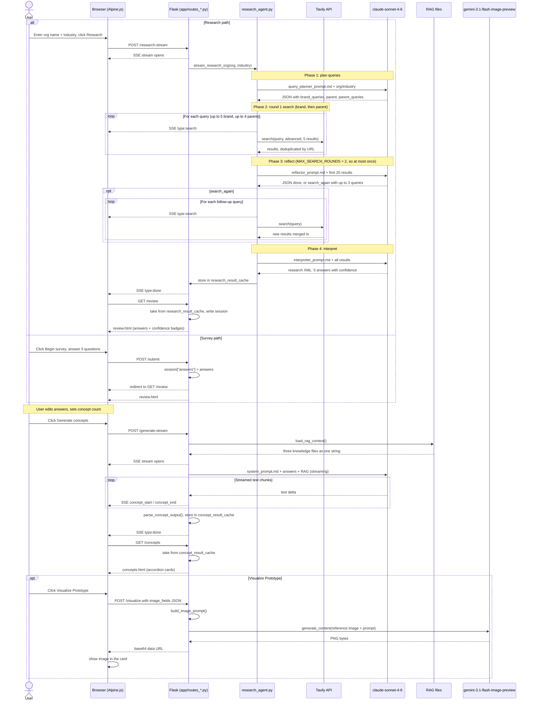
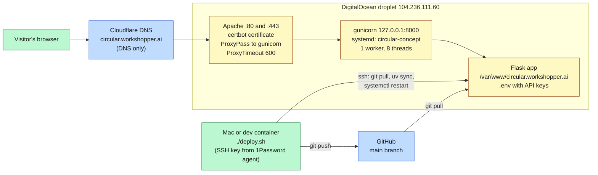
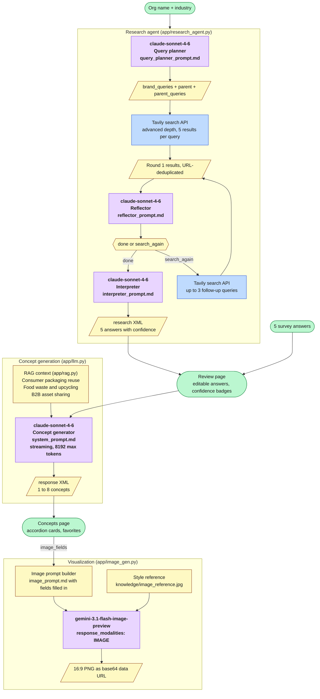

# Architecture

## Sequence diagram

## Deployment

## Model interactions

## Model summary

| Model | Role | Prompt file | Max tokens (constant) |
|---|---|---|---|
| `claude-sonnet-4-6` | Query planner | `query_planner_prompt.md` | 768 (`QUERY_PLANNER_MAX_TOKENS`) |
| `claude-sonnet-4-6` | Research reflector | `reflector_prompt.md` | 256 (`REFLECTOR_MAX_TOKENS`) |
| `claude-sonnet-4-6` | Research interpreter | `interpreter_prompt.md` | 2048 (`INTERPRETER_MAX_TOKENS`) |
| `claude-sonnet-4-6` | Concept generator | `system_prompt.md` | 8192 (`CONCEPT_GENERATION_MAX_TOKENS`) |
| `gemini-3.1-flash-image-preview` | Prototype visualizer | `image_prompt.md` | not applicable |

Model names are set once in `config.py` (`CLAUDE_MODEL`, `GEMINI_IMAGE_MODEL`). The token limits and search caps are named constants at the top of the module that uses them.

## External APIs

| Service | Used by | Purpose |
|---|---|---|
| Anthropic | `llm.py`, `research_agent.py` | All Claude calls |
| Tavily | `research_agent.py` | Web search, advanced depth, 5 results per query |
| Google AI | `image_gen.py` | Gemini image generation |
| PostHog (optional) | `analytics.py`, `base.html` | Product analytics and AI observability |
