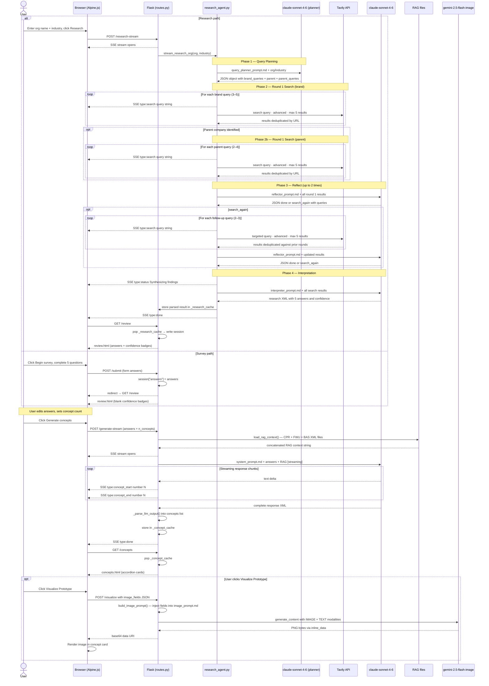
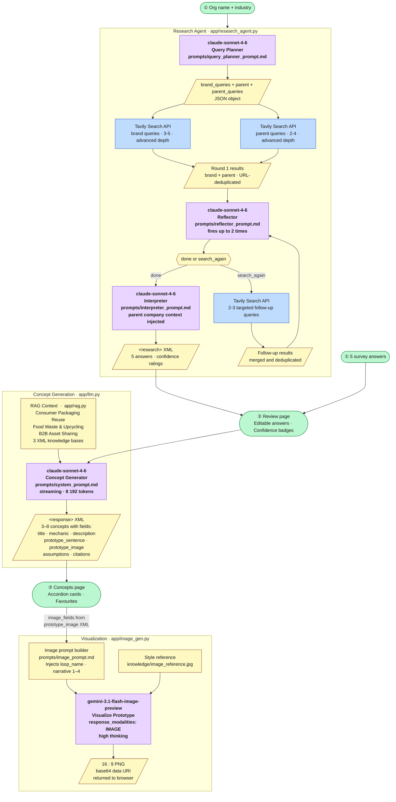

# Architecture Diagram

## UML Sequence Diagram

---

## LLM Model Interactions

## Model summary

| Model | Role | Prompt file | Max tokens |
|---|---|---|---|
| `claude-sonnet-4-6` | Query planner | `query_planner_prompt.md` | 768 |
| `claude-sonnet-4-6` | Research reflector | `reflector_prompt.md` | 256 |
| `claude-sonnet-4-6` | Research interpreter | `interpreter_prompt.md` | 2 048 |
| `claude-sonnet-4-6` | Concept generator | `system_prompt.md` | 8 192 |
| `gemini-3.1-flash-image-preview` | Prototype visualizer | `image_prompt.md` | — |

## External APIs

| Service | Used by | Purpose |
|---|---|---|
| Tavily | Research agent | Web search · advanced depth · 5 results/query |
| Anthropic | llm.py · research_agent.py | All Claude calls |
| Google AI | image_gen.py | Gemini image generation |